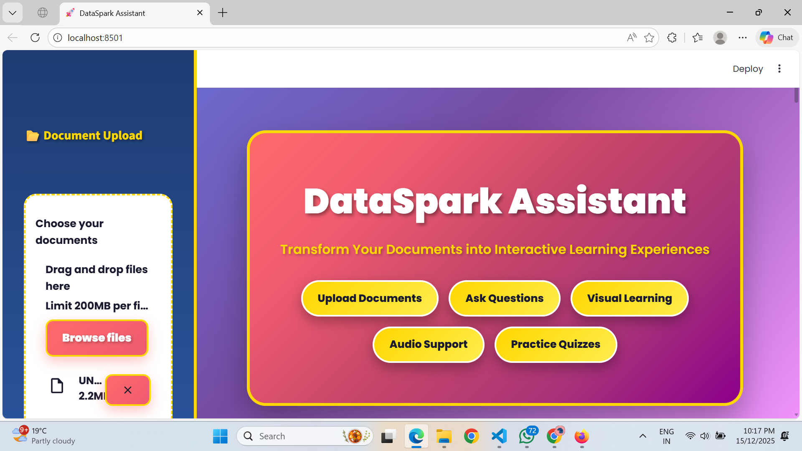
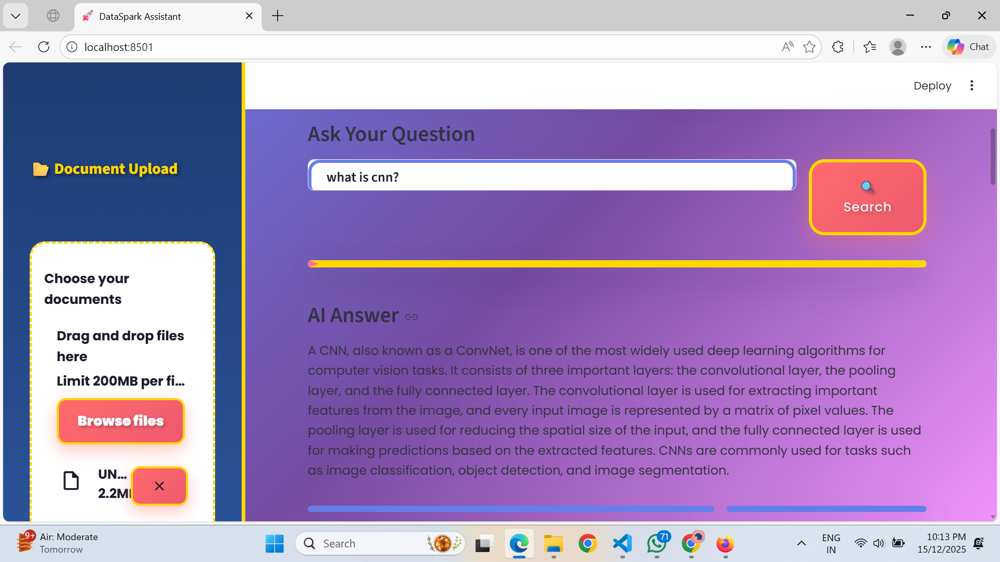
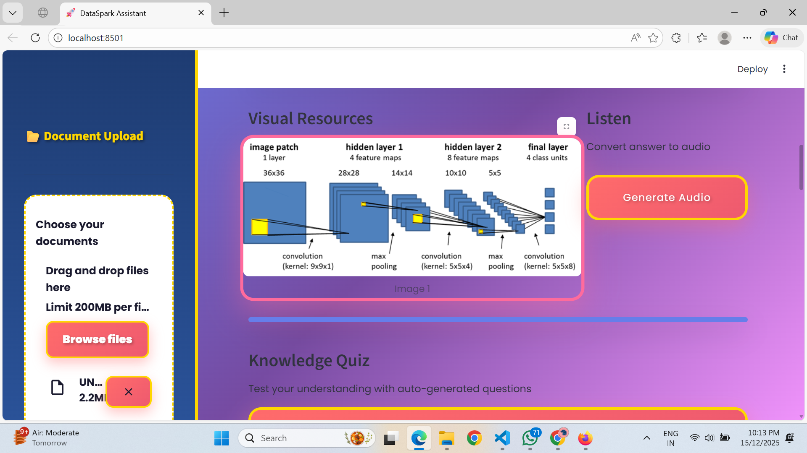
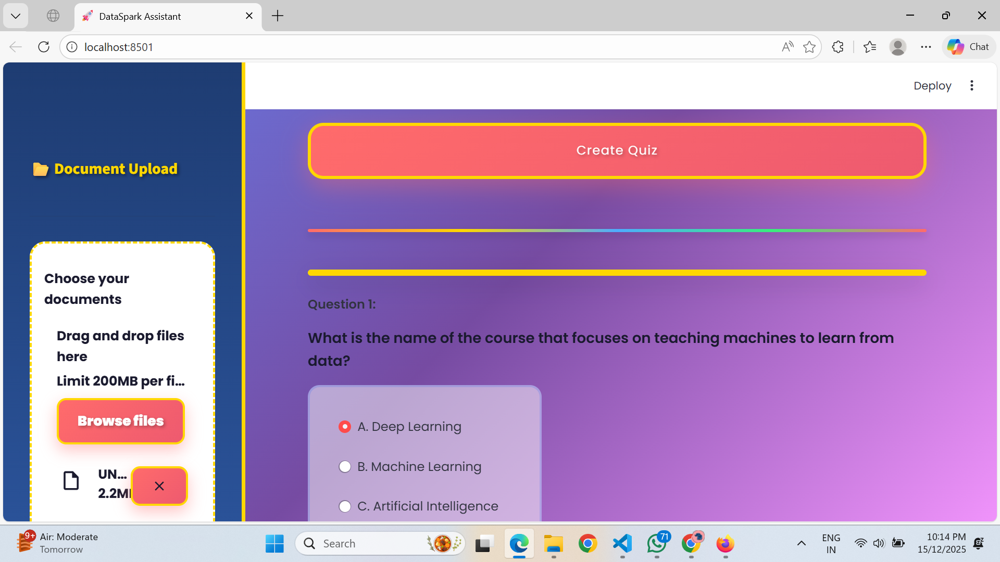

# 🤖 Agentic RAG Bot

An intelligent **Retrieval-Augmented Generation (RAG)** system that enhances Large Language Model responses by retrieving relevant context before generating answers.

---

## 🚀 Project Overview

Agentic RAG Bot is an AI-powered system that:

- Retrieves relevant document chunks using embeddings
- Enhances LLM responses with contextual grounding
- Generates quizzes dynamically
- Supports Speech-to-Text and Text-to-Speech
- Provides image-based learning explanations

This system reduces hallucinations and improves answer accuracy by combining retrieval with generation.

---

## 🧠 Key Features

- ✅ Retrieval-Augmented Generation (RAG Pipeline)
- ✅ Embedding-based similarity search
- ✅ Context-aware response generation
- ✅ Quiz generation module
- ✅ Speech-to-Text integration
- ✅ Text-to-Speech output
- ✅ Image-based explanations
- ✅ Modular backend architecture
- ✅ Deployment configuration with Nginx

---

## 🏗️ Architecture

User Query  
⬇  
Generate Embedding  
⬇  
Similarity Search (Retrieve relevant document chunks)  
⬇  
Combine Retrieved Context + Query  
⬇  
Pass to LLM  
⬇  
Generate Context-Aware Response  

---

## 📂 Project Structure

```
backend/
│── rag.py
│── embeddings.py
│── loader.py
│── quiz.py
│── speech_to_text.py
│── tts.py
│── image_generator.py
│── images.py

assets/
│── output1.png
│── output2.png
│── output3.png
│── output4.png

app.py
requirements.txt
deploy_app.sh
deploy_setup.sh
nginx_dataspark.conf
```

---

## 🛠️ Tech Stack

- Python
- OpenAI API
- Embeddings
- NLP Techniques
- Nginx (Deployment)
- Shell scripting

---

## ⚙️ Installation & Setup

### 1️⃣ Clone the repository

```
git clone https://github.com/shalz510/ragbot.git
cd ragbot
```

### 2️⃣ Install dependencies

```
pip install -r requirements.txt
```

### 3️⃣ Create a `.env` file

```
OPENAI_API_KEY=your_api_key_here
```

### 4️⃣ Run the application

```
python app.py
```

---

## 📸 Project Outputs

### 🔹 Output 1


### 🔹 Output 2


### 🔹 Output 3


### 🔹 Output 4


---

## 🎯 Use Cases

- AI-powered document assistant
- Educational chatbot
- Knowledge-based Q&A system
- Smart tutoring applications
- Enterprise document intelligence

---

## 🔮 Future Improvements

- Vector database integration (FAISS / Pinecone)
- Docker containerization
- Cloud deployment (AWS / Azure)
- User authentication system
- Multi-document upload support

---

## 👩‍💻 Author

**Shalini**  
AI & Software Engineering Enthusiast  
